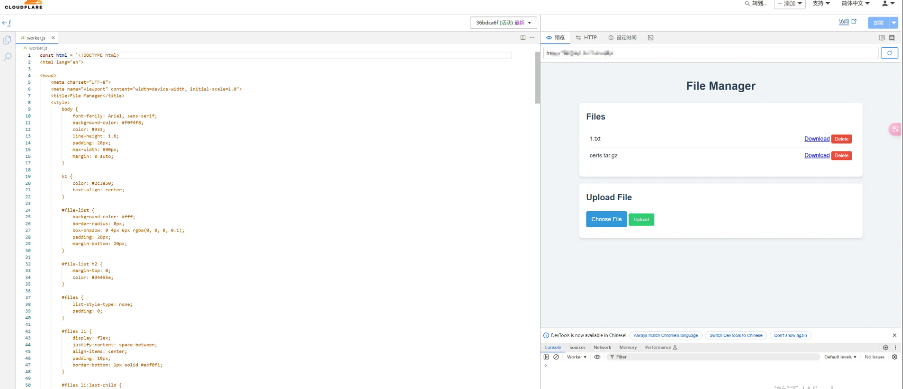

# 需求来源：

多台服务器使用同一个一级域名，虽然有一台服务器使用acme或者1panel申请了通配符证书（免费版，3个月需要续签一次），但是想要把证书分发到各个其他服务器是个麻烦事，旧方案：

1.  手动拷贝证书文件
2.  服务器A申请完证书后通过scp和相关命令复制证书到其他服务器，并重启其他服务器的相关依赖服务如nginx

想了想，管理起来还是麻烦，虽然有类似的管理服务（[certd](https://github.com/certd/certd)），但是我总觉得不对劲，有必要这么麻烦吗？

**不就是一个分发的问题吗？把证书丢到一个地方，哪个服务器需要自己去拿不就行了？**

# 解决方案：

正好我是cloudflare的忠实用户，域名绑定也是用的cloudflare的ddns方案，干脆使用cloudflare全家桶吧！

*   使用cloudflare的worker、R2存储实现简易版文件服务器
*   写2个脚本，分别用于：
    *   证书申请服务器，申请证书后上传证书文件（加密）
    *   使用证书的服务器，2个月下载一次证书文件（解密+部署）

# 一、基于cloudflare workers和R2存储实现的文件中转服务器

参考<https://blog.csdn.net/Ireviewstart666/article/details/14409271411> ，<https://zhul.in/2024/08/13/build-restful-api-for-cloudflare-r2-with-cloudflare-workers/>, 改造一番实现简单文件中转服务器，但是加上了鉴权。

除了证书分发，还可用于存储个人文件，支持文件上传、下载、删除


支持凭据鉴权


## 文件服务器部署到cloudflare

代码：<https://github.com/Carnia/cloudflare-storage>

1.  首先你得有cloudflare账号，并且开启R2存储
2.  在cloudflare新建一个worker，将此[仓库](https://github.com/Carnia/cloudflare-storage)的index.js拷贝进worker并部署


3\. 在此worker的设置选项中内新建环境变量`AUTH_KEY_SECRET`，并设置一个你记得住的密码（用于网页或者接口鉴权，放在请求头`X-Custom-Auth-Key`里）

4.  在cloudflare新建一个R2存储桶，随意命名。
5.  在worker中绑定此R2存储桶，并赋予此桶变量名`FILE_BUCKET`


6\. 再次部署worker

此时在打开cloudflare给你的域名，就可以看到web管理界面。

同时还支持直接通过api上传、下载、删除。

## 部署之后，API也就能用了

### 不需要鉴权

查看文件列表：
`curl <https://your-worker.your-subdomain.workers.dev/>`

下载文件：
`curl <https://your-worker.your-subdomain.workers.dev/filename.txt>`

### 需要鉴权

上传文件：
`curl -X PUT <https://your-worker.your-subdomain.workers.dev/filename.txt>  --data-binary @filename.txt -H "X-Custom-Auth-Key: your-auth-key"`

删除文件：
`curl -X DELETE <https://your-worker.your-subdomain.workers.dev/filename.txt> -H "X-Custom-Auth-Key: your-auth-key"`

## 接下来就是证书上传、下载的脚本了

如

**服务器A** 申请完证书，通过此接口将证书加密压缩后上传到cloudflare的R2存储：

```sh
#!/bin/bash

# 配置参数
AUTH_KEY="your-auth-key"
WORKER_URL="https://your-worker.your-subdomain.workers.dev"
CERT_DIR="/cert"
OUTPUT_FILE="certs.tar.gz"
ENCRYPT_KEY="your-encryption-key"

# 1. 压缩并加密
tar -czf - -C $CERT_DIR | openssl enc -aes-256-cbc -salt -pass pass:$ENCRYPT_KEY -out $OUTPUT_FILE

# 2. 上传
curl -X PUT "$WORKER_URL/$OUTPUT_FILE" --data-binary @$OUTPUT_FILE -H "X-Custom-Auth-Key: $AUTH_KEY"

# 清理临时文件
rm -f $OUTPUT_FILE
```

**服务器B** 定期执行如下脚本：从cloudflare下载证书，解密解压后，重启依赖证书的应用

```sh
#!/bin/bash

# 配置参数
WORKER_URL="https://your-worker.your-subdomain.workers.dev"
FILE_NAME="certs.tar.gz"
ENCRYPT_KEY="your-encryption-key"
CERT_DIR="/cert"

# 1. 下载
curl -o $FILE_NAME "$WORKER_URL/$FILE_NAME"

# 2. 解密并解压
openssl enc -d -aes-256-cbc -pass pass:$ENCRYPT_KEY -in $FILE_NAME | tar -xzf - -C $CERT_DIR

# 3. 执行nginx重启和refresh脚本
systemctl restart nginx # 可选
docker restart x-ui # 可选

# 清理临时文件
rm -f $FILE_NAME
```

当然，这2个脚本只是简单示例，还可以加上通知，完整示例见：<https://github.com/Carnia/cloudflare-storage/tree/main/cret_sh>

## 最后

感谢赛博大善人CLOUDFLARE！
